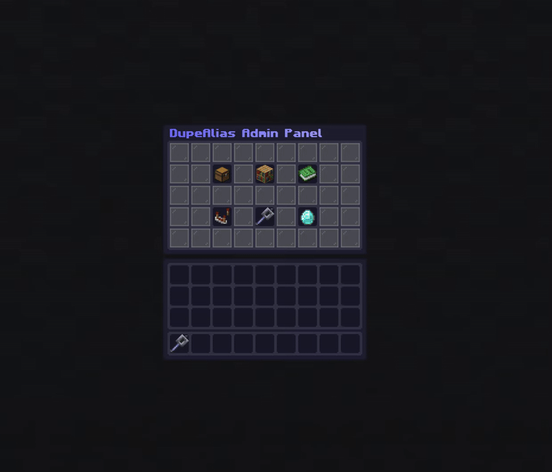
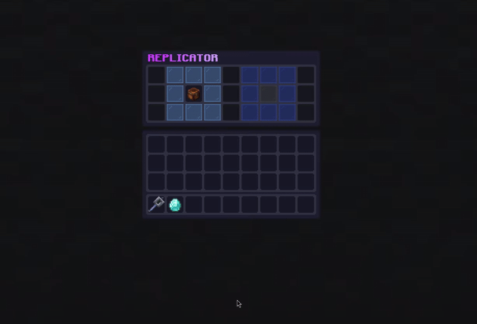
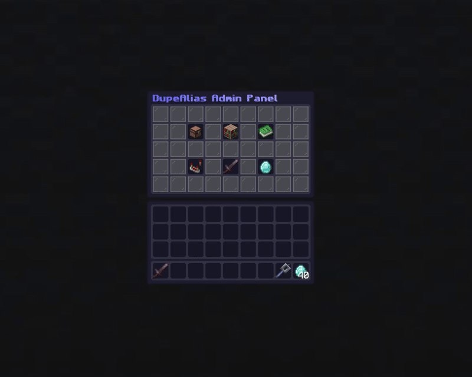

# DupeAlias - An Advanced Dupe Plugin
**Make your server stand out by switching to DupeAlias, a powerful dupe plugin with niche features for unique servers.**
  
---   
## Why Choose DupeAlias?
DupeAlias gives you unprecedented control over how items can be copied or duplicated on your server. Configurable through a sleek in-game GUI, DupeAlias provides a friction-free administration experience.

### Key Features
**Smart Item Tagging System**
- **UNIQUE** - Prevent specific items from being duplicated
- **FINAL** - Lock items against any modifications
- **INFINITE** - Create stacks that never run out
- **PROTECTED** - Make items completely inert and unusable

**Advanced Global Rules Engine**
- Create complex rules based on item properties
- Match by material, enchantments, name patterns, lore, attributes, and more
- Support for ItemsAdder
- Flexible matching modes (AND, OR, NAND, XOR)

**Multiple Duplication Interfaces**
- **Replicator GUI** - Single-item duplication with visual feedback
- **Chest GUI** - Multi-item container-style duplication
- **Inventory GUI** - Mirror your entire inventory for easy access
- **Menu GUI** - Central hub for all duplication options

**Performance & Customization**
- Per-permission refresh rates and cooldowns
- Extensive configuration options
- Session persistence (optional)
- Beautiful, modern GUIs with progress indicators

---   
## Perfect For These Server Types
- **Survival/Creative** - Give players infinite building blocks while protecting valuable items
- **Dupe Servers** - Create economies in an otherwise chaotic server class
- **Minigames** - Provide infinite consumables while preventing exploitation
- **RPG Servers** - Protect quest items and create unbreakable gear (You don't *have* to use the dupe feature!)

---   
## Screenshots

The main Admin Panel, click on the green book for a quick guide on how to use the plugin.  
  
The Replicator GUI is a great choice for the default dupe GUI. It is clean, simple, and you have good control over how its used.  
  
The Global Rule Editor is designed to be intuitive to use, with quick buttons for changing match modes and toggling tags.  
  
Want to know how an item is processed? Head over to the help GUI and hover on you held item's icon. An explanation will be generated for you.  

  
---   
## Quick Setup
1. Drop `DupeAlias.jar` into your plugins folder
2. Restart your server
3. Use `/da` to open the admin panel
4. Configure your global rules and permissions
5. Let your players use `/dupe` to start duplicating!

---   
## Permissions Overview
- `dupealias.admin` - Access to admin panel and configuration
- `dupealias.dupe` - Basic duplication command access
- `dupealias.gui.*` - Access to specific GUI types
- `dupealias.*.bypass` - Bypass tag restrictions (use carefully!)
- Permission-based refresh rates: `dupealias.gui.replicator.refresh.1`

---   
## Use Cases
**Crate Key Protection** Create a global rule that makes all items containing `"excellentcrates:crate_key.id"` in their NBT tag, UNIQUE, FINAL, and PROTECTED, preventing duplication and accidental use.

**Infinite Building Materials** Set up INFINITE tags on common building blocks, giving your players unlimited resources for creative purposes.

**Rank Kit Exclusivity** Combine both FINAL and UNIQUE tags on rank crates to prevent ranked players from modifying and redistributing exclusive branded kits.

**Admin Tool Management** Add the UNIQUE tag to admin-only items so they cannot be duplicated by regular players.
  
---  

## Requirements
- **Minecraft Version**: 1.21.5
- **Server Software**: Paper
- **Java Version**: 21+

## Documentation
- [Documentation is available in Documentation.md](Documentation.md)
